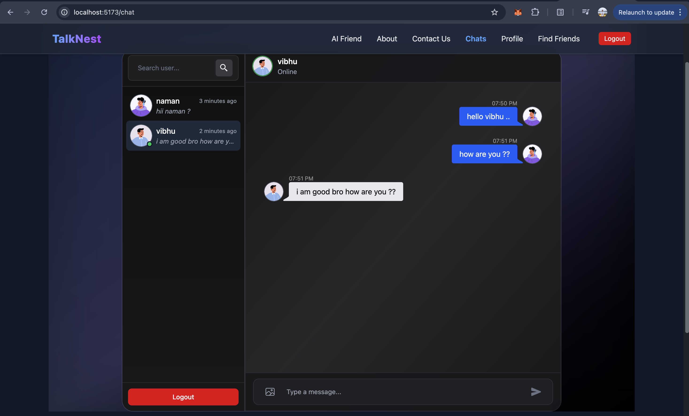
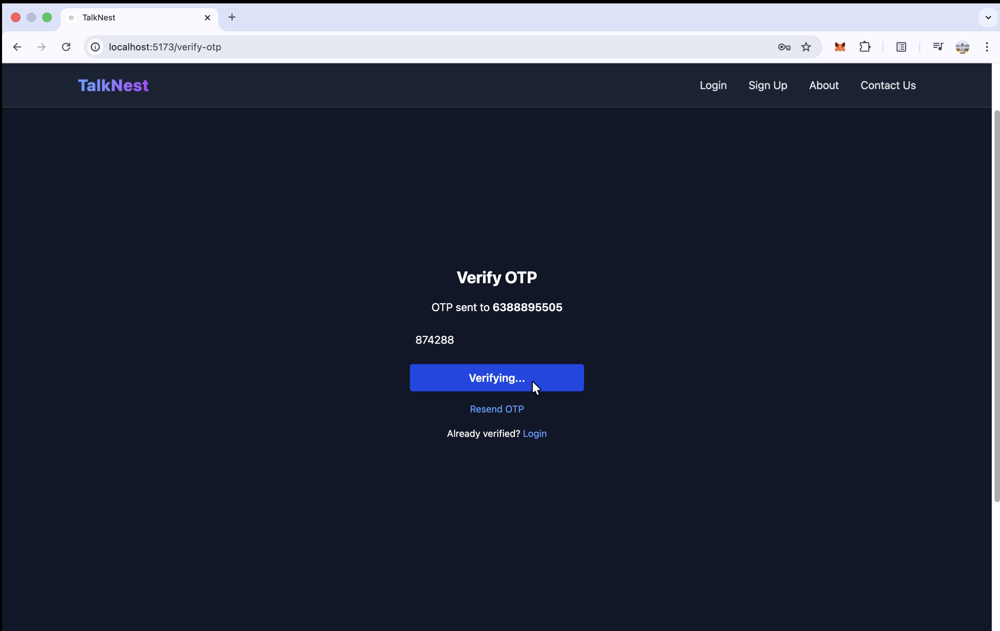

# 🌐 TalkNest – Real-Time Chat Application


---

## 🎥 Demo Video

<p align="center">
  <a href="https://drive.google.com/file/d/1OgglLVuArBODFZJuY3bBHPRYzwh_j3DQ/view?usp=drive_link">
    
  </a>
</p>

> Click the thumbnail above to watch the demo video of **Talk Nest – Real-Time Chat Application**.


## Chats & Friends

<p align="center">
  
  
</p>


---

## 🏠 Live Link

🔗 [TalkNest on Render](https://talknest-real-time-chat-application.onrender.com)

---

## 🚀 Overview

**TalkNest** is a full-stack **real-time chat platform** that enables users to connect, chat instantly, share media, and manage friendships securely.
It features **Twilio OTP authentication**, **JWT-based security**, and **Socket.IO-powered messaging** for an instant communication experience.

---

## ✨ Features

### ✅ Authentication & Access

* OTP-based login via **Twilio**
* Password-based login with **JWT authorization**
* Secure session management

### 💬 Real-Time Messaging

* 1:1 private chat powered by **Socket.IO**
* Live message delivery and online presence
* Chat only with approved friends

### 👥 Friend System

* Send, accept, or decline friend requests
* Chat only between connected users (friends)

### 📎 Media Sharing

* Share images, videos, audio, and documents
* Preview support for **PDF, Excel, Docs, and Photos**

### 🎨 UI / UX

* Responsive design built with **React + Tailwind CSS**
* Smooth, modern chat interface
* Real-time updates and animations

---

## 🧱 Architecture Overview

TalkNest follows a **modular client–server architecture** for scalability, maintainability, and real-time performance.

### 🖥️ Frontend (React + Vite)

* Built with **React.js**, **Vite**, and **Tailwind CSS**
* State management via **Redux Toolkit**
* Real-time updates via **Socket.IO client**
* API communication through Axios

### ⚙️ Backend (Node.js + Express)

* RESTful APIs for authentication, friends, and chat
* **Twilio integration** for OTP
* **JWT middleware** for route protection
* File upload handling
* **Socket.IO server** for real-time chat events

### 🗄️ Database (MongoDB + Mongoose)

* Stores user data, messages, and friend relationships
* Optimized queries and schema validation

### ☁️ Deployment

* Hosted on **Render**
* Environment variables secured via `.env`
* CI/CD support for seamless deployment

---

## 🛠️ Tech Stack

| Layer          | Technologies                                                |
| -------------- | ----------------------------------------------------------- |
| Frontend       | React.js, Vite, Redux Toolkit, Tailwind CSS                 |
| Backend        | Node.js, Express.js                                         |
| Real-Time      | Socket.IO                                                   |
| Database       | MongoDB + Mongoose                                          |
| Authentication | JWT + Twilio OTP                                            |
| AI Chat        | Google Gemini API                                           |
| Deployment     | Render (Backend & Database)


## ⚡ Setup Instructions

### 1️⃣ Clone the repository

```bash
git clone https://github.com/satyampandey444/TalkNest.git
cd TalkNest
```

---


#### Create a `.env` file inside the **backend** directory:

```
# Example .env file for TalkNest

PORT=3000||or any other
MONGO_URI=<your-mongodb-uri>
JWT_SECRET_KEY=<your-jwt-secret>
GEMINI_API_KEY=<your-gemini-api-key>
CLOUDINARY_CLOUD_NAME=<your-cloud-name>
CLOUDINARY_API_KEY=<your-cloudinary-api-key>
CLOUDINARY_API_SECRET=<your-cloudinary-api-secret>
TWILIO_ACCOUNT_SID=<your-twilio-sid>
TWILIO_AUTH_TOKEN=<your-twilio-auth-token>
TWILIO_PHONE_NUMBER=<your-twilio-phone>

```

---

## 📂 Folder Structure

```
TalkNest/
│
├── backend/                         # Node.js Backend
│   ├── config/                      # Database / Server Config
│   ├── controllers/                 # API Controllers
│   ├── middleware/                  # Auth / Error Middleware
│   ├── models/                      # Mongoose Models
│   ├── routes/                      # API Routes
│   ├── socket/                      # Socket.IO Events
│   ├── index.js                     # Entry Point
│   ├── .env                         # Environment Variables
│   ├── package.json
│   ├── package-lock.json
│   ├── node_modules/
│   └── .gitignore
│
├── frontend/                        # React Frontend (Vite)
│   ├── public/                      # Static Assets
│   ├── src/
│   │   ├── assets/                  # Images / Icons
│   │   ├── components/              # Reusable Components
│   │   ├── context/                 # Auth & Socket Contexts
│   │   ├── hooks/                   # Custom React Hooks
│   │   ├── redux/                   # Redux Slices & Store
│   │   ├── App.jsx                  # Root Component
│   │   ├── index.css                # Global Styles
│   │   └── main.jsx                 # Entry File
│   ├── eslint.config.js
│   ├── index.html
│   ├── vite.config.js
│   ├── package.json
│   ├── package-lock.json
│   └── node_modules/
│
└── README.md
```


# Talk Nest — OTP-based Phone Login (Twilio)

## 🎯 Overview

This repository (Talk Nest — Real-Time Chat Application) supports an **OTP-based login/registration flow by mobile number** implemented using **Twilio**.  
> **Important:** The live deployed site currently does **not** use Twilio OTP due to Twilio account limitations (trial/subscription). The OTP code and backend endpoints are included in this repo so you can enable OTP locally or after upgrading your Twilio account.

This README explains:
- how the OTP flow works,
- how to run it locally using Twilio (trial or full account),
- a minimal backend example (Node/Express + Twilio Verify),
- a minimal frontend integration example,
- deployment notes & troubleshooting.

---

## 🚦 OTP Flow (high-level)

1. User enters a phone number on the client (e.g. `+91xxxxxxxxxx`).
2. Client calls your backend endpoint `/api/v1/auth/send-otp` with the phone number.
3. Backend uses Twilio Verify (or Twilio SMS) to send a one-time code to the number.
4. User enters the code in the app and client calls `/api/v1/auth/verify-otp` with `{ phone, code }`.
5. Backend verifies the code with Twilio:
   - If valid: create / fetch user, sign a session or JWT, and return auth info.
   - If invalid: return an error to the client.

---

## ⚙️ Why OTP is disabled on the deployed site

Twilio trial accounts have strict constraints:
- limited messaging to verified phone numbers,
- required account upgrade to remove restrictions and to send SMS to unverified recipients,
- costs per SMS for production.
- Implemented forget password feature using twilio sending otp for password reset.

Because the public deployment is on a free/limited Twilio subscription, OTP is **not enabled on the live site** to avoid broken behavior for visitors. Locally (or in production after upgrading Twilio) you can enable it by setting the proper environment variables.

---

## 🎥 Demo Video for Otp Based Login

<p align="center">
  <a href="https://drive.google.com/file/d/17vp_mcGQiajbPGOHNzaVLIpNPBE8OCao/view?usp=drive_link">
    
  </a>
</p>

> Click the thumbnail above to watch the demo video of **Talk Nest – Real-Time Chat Application with Registration with Otp on Mobile Nnmber**.


## Verification & Otp

<p align="center">
  
  
</p>

---

## 🧑‍💻 Contributing

Contributions are welcome!
If you’d like to improve the project:
Feel free to Contact

---

## 📜 License

This project is licensed under the **MIT License** 

---

## 🤝 Connect

Created with ❤️ by Satyam Pandey
📧 Email: [satyampandey5505@gmail.com](mailto:satyampandey5505@gmail.com)
🌍 GitHub: [satyampandey444](https://github.com/satyampandey444)
